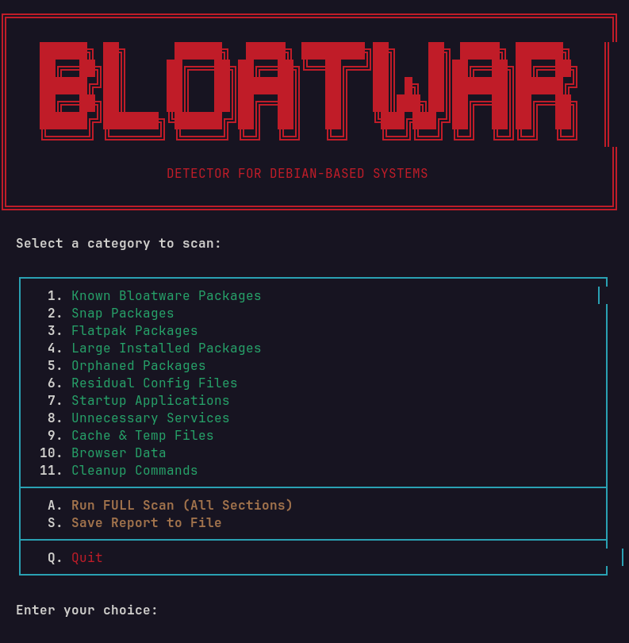
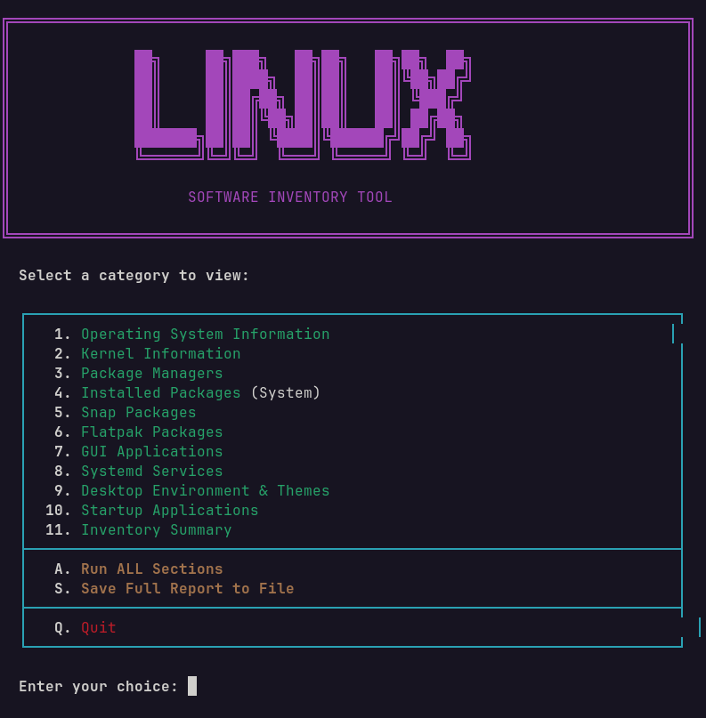

# Linux Scripts

Collection of interactive TUI tools for Linux system administration.

## Scripts

| Script | Description |
|--------|-------------|
| [bloatwar](bloatwar/) | Bloatware detection for Debian-based systems |
| [linux_inventory](linux_inventory/) | Software inventory tool |
| [linux_system_info](linux_system_info/) | Comprehensive system information |
| [network_control](network_control/) | Network configuration and management |

## Screenshots

### Bloatwar

### Linux Inventory

### Linux System Info

## Requirements

- Bash 4.0+
- Linux distribution (Debian-based for bloatwar)
