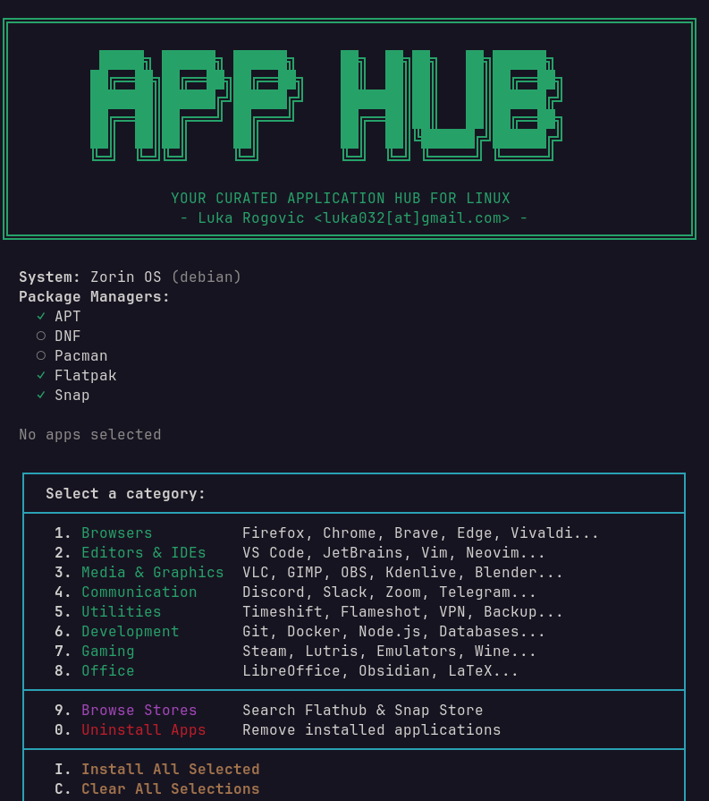

# App Hub

Your curated application hub for Linux with intelligent distro detection and user-selectable installation sources.



## What it does

- Automatically detects your Linux distribution (Debian/Ubuntu, Fedora/RHEL, Arch)
- Provides a curated list of popular applications organized by category
- Lets you choose the installation source for each app (native, Flatpak, or Snap)
- Supports batch selection and installation
- Shows installation status for each application

## Supported Distributions

| Type | Distributions |
|------|---------------|
| Debian-based | Ubuntu, Linux Mint, Pop!_OS, Zorin, Debian, elementary OS, MX Linux |
| Red Hat-based | Fedora, RHEL, CentOS, Rocky Linux, Alma Linux, Nobara |
| Arch-based | Arch Linux, Manjaro, EndeavourOS, Garuda, Artix |

## Package Managers

| Manager | Description |
|---------|-------------|
| APT | Debian/Ubuntu native packages |
| DNF | Fedora/RHEL native packages |
| Pacman | Arch Linux native packages (+ AUR via yay) |
| Flatpak | Sandboxed apps from Flathub |
| Snap | Canonical's universal packages |

## Categories (300+ Apps)

| Category | Applications |
|----------|-------------|
| Browsers | Firefox, Chrome, Brave, Edge, Vivaldi, Opera, LibreWolf, Tor, Floorp... |
| Editors & IDEs | VS Code, JetBrains, Sublime, Vim, Neovim, Zed, Android Studio... |
| Media & Graphics | VLC, GIMP, OBS, Kdenlive, Blender, Audacity, Spotify, DaVinci... |
| Communication | Discord, Slack, Zoom, Teams, Telegram, Signal, Element, Thunderbird... |
| Utilities | Timeshift, Bitwarden, VPN clients, File managers, Backup tools... |
| Development | Git, Docker, Kubernetes, Node.js, Python, Rust, Databases, DevOps... |
| Gaming | Steam, Lutris, Heroic, Wine, RetroArch, Emulators, MangoHud... |
| Office | LibreOffice, Obsidian, Joplin, LaTeX, GnuCash, Calibre, Draw.io... |

## Usage

Give it permission to run:
```bash
chmod +x app-hub.sh
```

Run the script:
```bash
./app-hub.sh
```

## How to Select Apps

1. Choose a category (1-6)
2. Enter the number of the app you want to install
3. Select the installation source (apt/dnf/pacman, flatpak, or snap)
4. The app will be marked with a green `*` and the chosen source
5. Press `I` to install all selected apps

## Navigation

| Key | Action |
|-----|--------|
| 1-8 | Select category |
| 9 | Browse Flathub & Snap Store |
| 0 | Uninstall applications |
| 1-N | Select app (shows source picker) |
| A | Select all in category (uses native package manager) |
| N | Deselect all in category |
| I | Install selected apps |
| C | Clear all selections |
| F | Setup/install Flatpak |
| S | Setup/install Snap |
| M | Return to main menu |
| Q | Quit |

## Browse App Stores

Option `7` lets you search and install apps directly from:

- **Flathub** - Search the Flatpak repository
- **Snap Store** - Search the Snap repository

Simply enter a search term, browse the results, and select an app to install.

## Uninstall Applications

Option `8` opens the uninstaller menu where you can remove:

- **Native Packages** - APT/DNF/Pacman packages (search or browse top 100 by size)
- **Flatpak Apps** - List all installed Flatpak applications
- **Snap Apps** - List all installed Snap packages

Each list shows package name, size, and description. Select a number to uninstall with confirmation.

## Arch Linux Notes

For AUR packages (marked with `-bin`, `-git` suffixes), the script uses `yay` as the AUR helper. Install yay first:
```bash
sudo pacman -S --needed git base-devel
git clone https://aur.archlinux.org/yay.git
cd yay && makepkg -si
```

## Requirements

- Bash 4.0+
- sudo access for installation
- For Arch: `yay` recommended for AUR packages
