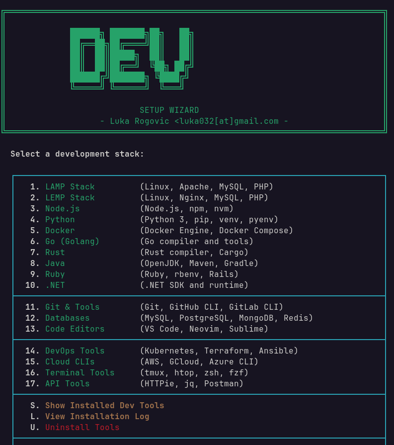

# Dev Setup Wizard

Interactive installer for development stacks and tools.



## What it does

Install and configure development environments:
- **LAMP Stack** - Apache, MySQL/MariaDB, PHP (version selection)
- **LEMP Stack** - Nginx, MySQL, PHP-FPM
- **Node.js** - Via NVM, NodeSource, or apt (version selection)
- **Python** - Python 3, pip, venv, pyenv
- **Docker** - Docker Engine, Compose, CLI
- **Go** - Golang compiler and tools
- **Rust** - Rust compiler, Cargo via rustup
- **Java** - OpenJDK (8/11/17/21), Maven, Gradle
- **Ruby** - Ruby, rbenv, Rails
- **.NET** - .NET SDK (6.0/7.0/8.0)
- **Git Tools** - Git, GitHub CLI, GitLab CLI, Git LFS
- **Databases** - MySQL, PostgreSQL, MongoDB, Redis, SQLite
- **Editors** - VS Code, Neovim, Sublime Text, Vim

## Usage

Give it permission to run
```bash
chmod +x dev-setup.sh
```
Run the script (requires sudo)
```bash
sudo ./dev-setup.sh
```

## Navigation

| Key | Action |
|-----|--------|
| 1-13 | Select stack/tool to install |
| S | Show installed dev tools |
| L | View installation log |
| Q | Quit |

## Requirements

- Bash 4.0+
- Debian/Ubuntu-based distribution
- Root/sudo access
- Internet connection
