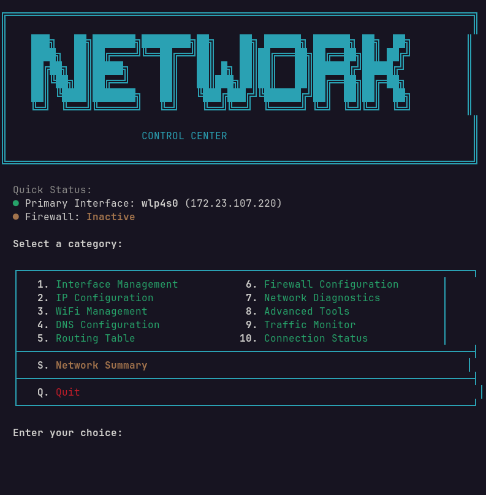

# Network Control

Network configuration and management tool for Linux.



## What it does

Configure and manage:
- Network interfaces (up/down, MTU, details)
- IP addresses (static, DHCP, gateway)
- WiFi (connect, disconnect, hotspot, saved networks)
- DNS servers (presets: Cloudflare, Google, Quad9, custom)
- Routing table (add/delete routes, gateway)
- Firewall (UFW) - enable/disable, allow/block ports and IPs
- Diagnostics (ping, traceroute, DNS lookup, port check, speed test)
- Advanced (MAC changer, Wake-on-LAN, ARP table)
- Traffic monitoring and connection status

## Usage

Give it permission to run
```bash
chmod +x network-control.sh
```
Run the script (requires sudo for most operations)
```bash
sudo ./network-control.sh
```

## Navigation

| Key | Action |
|-----|--------|
| 1-10 | Select category |
| S | Network summary |
| R | Refresh current section |
| M | Return to menu |
| Q | Quit |

## Requirements

- Bash 4.0+
- Linux distribution
- Root/sudo access for most operations
- Optional: NetworkManager (nmcli), ufw, speedtest-cli
