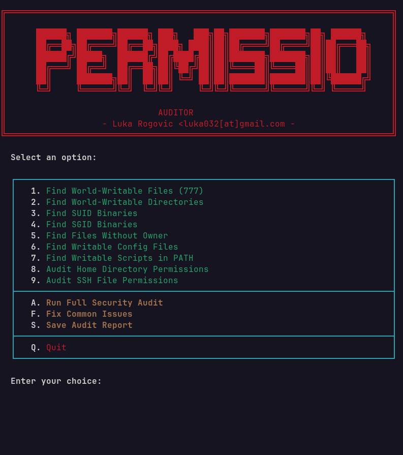

# Permission Auditor

Find and fix dangerous file permissions on Linux systems.



## What it does

Scans for security issues:
- World-writable files (777) and directories
- SUID/SGID binaries (potential privilege escalation)
- Files without owner (orphaned files)
- Writable config files in /etc
- Writable scripts in PATH
- Home directory permission issues
- SSH file permission issues

Can automatically fix:
- Home directory permissions
- SSH directory and key permissions
- Temp directory sticky bits
- Critical system file permissions
- Orphaned file ownership

## Usage

Give it permission to run
```bash
chmod +x permission-auditor.sh
```
Run the script (recommended with sudo for full scan)
```bash
sudo ./permission-auditor.sh
```

## Navigation

| Key | Action |
|-----|--------|
| 1-9 | Select scan category |
| A | Run full security audit |
| F | Fix common issues |
| S | Save audit report |
| R | Rescan current section |
| M | Return to menu |
| Q | Quit |

## Requirements

- Bash 4.0+
- Linux distribution
- Root/sudo for full scan and fixes
