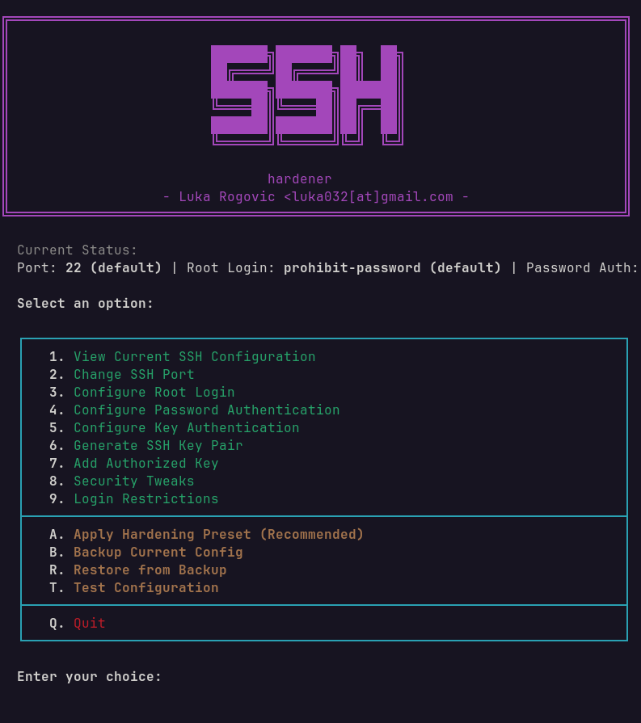

# SSH Hardener

Secure your SSH server configuration.



## What it does

Configure and harden SSH:
- Change SSH port
- Disable root login
- Configure password/key authentication
- Generate SSH key pairs
- Add authorized keys
- Security tweaks (max auth tries, timeouts, X11 forwarding)
- Login restrictions (allow/deny users/groups)
- Apply recommended hardening preset
- Backup and restore configurations

## Usage

Give it permission to run
```bash
chmod +x ssh-hardener.sh
```
Run the script (requires sudo)
```bash
sudo ./ssh-hardener.sh
```

## Navigation

| Key | Action |
|-----|--------|
| 1-9 | Select category |
| A | Apply hardening preset |
| B | Backup config |
| R | Restore from backup |
| T | Test configuration |
| Q | Quit |

## Hardening Preset

Option A applies these recommended settings:
- Port 2222
- Root login disabled
- Max auth tries: 3
- Login grace time: 30s
- X11 forwarding disabled
- Idle timeout: 5 minutes

## Requirements

- Bash 4.0+
- Linux distribution
- OpenSSH server installed
- Root/sudo access
